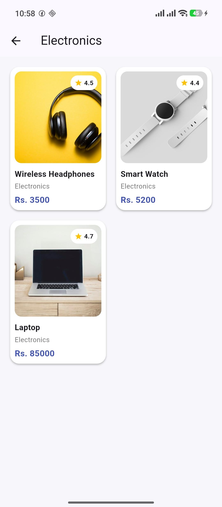

# mini_ecommerce

Name: Rijal Maharjan

University id: 2527640

Mobile Application Development (MAD)

## Description
This project is a mini e-commerce mobile application developed using Flutter and Dart. It allows users to browse product categories, explore products, and view product details through a simple and user-friendly interface.

## Features
Home Page: Displays promotional banners, product categories, and popular products.
Image Carousel: Automatically displays promotional banners using the Carousel Slider package.
Category Page: Shows products belonging to the selected category.
Product Details: Displays product images, names, prices, ratings, and descriptions.
Navigation: Allows users to move between the home, category, and product details pages.
Add to Cart Feedback: Displays a message when the Add to Cart button is pressed.

## Screenshots

### Home Page

### Product and Cart Demo

### Category Pages

#### Beauty

#### Electronics

#### Fashion

#### Shoes

## Packages Used
carousel_slider: Used to create an automatically sliding promotional banner carousel.

Flutter Material: Used to build the application's interface with standard Flutter widgets.

## How to Run
Open the project in Android Studio.
Open the terminal in the project directory.
Run flutter pub get to install the required dependencies.
Start an Android emulator or connect a device.
Run flutter run to launch the application.